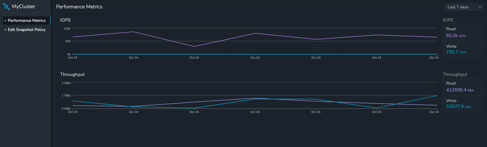

# Cluster Turborepo Project

This is the Cluster Exercise built using [Turborepo](https://turbo.build/repo/docs)

## Installation
1. In the root directory, run this command: `yarn install`. This will install all the package with the dependencies.
2. Create `.env` files in the `apps/cluster-frontend` and `apps/cluster-backend` directory. Please check your email for the respective env files.
3. The backend project uses [postgres]((https://www.postgresql.org/). Be sure to install `postgres` on your system. If you want to use some other database, please change the `apps/cluster-backend/config/database.ts` file accordingly.
4. Navigate to `apps/cluster-backend` to run the following command to execute the migrations: `node ace migration:run`.
5. At the root of the projet, execute this command to run your project: `yarn dev`. This will start both projects in seperate terminals. Your backend server will run on [http://localhost:3333](http://localhost:3333) and your frontend server will run on [http://localhost:3000](http://localhost:3000).

## What's inside?

The backend project contains a `generateDummyData.js` that generate a json file in `data/dummy-data.json` which will have dummy data for the cluster. There's no harm in executing this file but you do not need to. The `data/dummy-data.json` has already been provided.

**I assumed there will always be one policy from the information provided in the email. Hence I made the controllers accordingly.**

## Test
You can run the tests by executing the following command in the root of the project: `yarn test`.

## Backend Details
The `cluster-backend` has 3 routes:
- GET `/api/getTimeSeries`: This will get the data for the cluster from the `data/dummy-data.json`.
- GET `/api/getPolicy`: This will get the policy stored in the database. If no policy is stored, it will return `{}`.
- PUT `/api/setPolicy`: This will update the existing policy in the database. Incase, there is no policy, it will create a new policy and store it in the database.

## Frontend Details
The `cluster-frontend` has 2 routes to visit:
1. `/` route will have the IOPS and Throughput graph
2. `/policy` route will have the Snapshot policy

## Snapshots of UI:
Performance Metrics

Snapshot Policy

