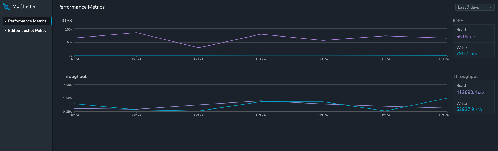
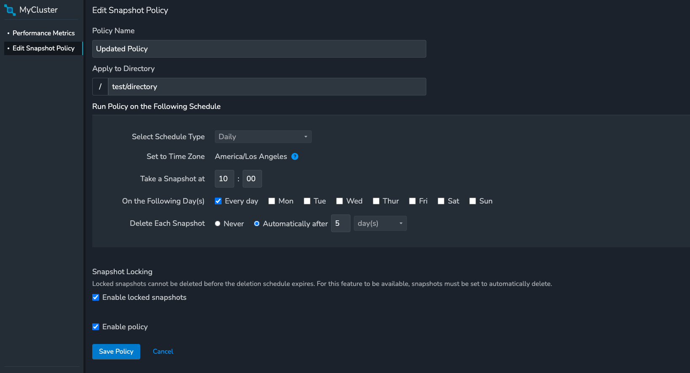

# Cluster Frontend Side

This is a [Next.js](https://nextjs.org) project bootstrapped with [`create-next-app`](https://nextjs.org/docs/app/api-reference/cli/create-next-app).

## Getting Started
1. Install the packages using `yarn install` or `npm install`
2. Create a `.env` file in the root of the project. The env file is provided to you via email
3. Run the development server using this command: `npm run dev` or `yarn dev`
4. Open [http://localhost:3000](http://localhost:3000) with your browser to see the result.

## Routes to visit
1. `/` route will have the IOPS and Throughput graph
2. `/policy` route will have the Snapshot policy

## Snapshots of UI
Performance Metrics

Snapshot Policy

